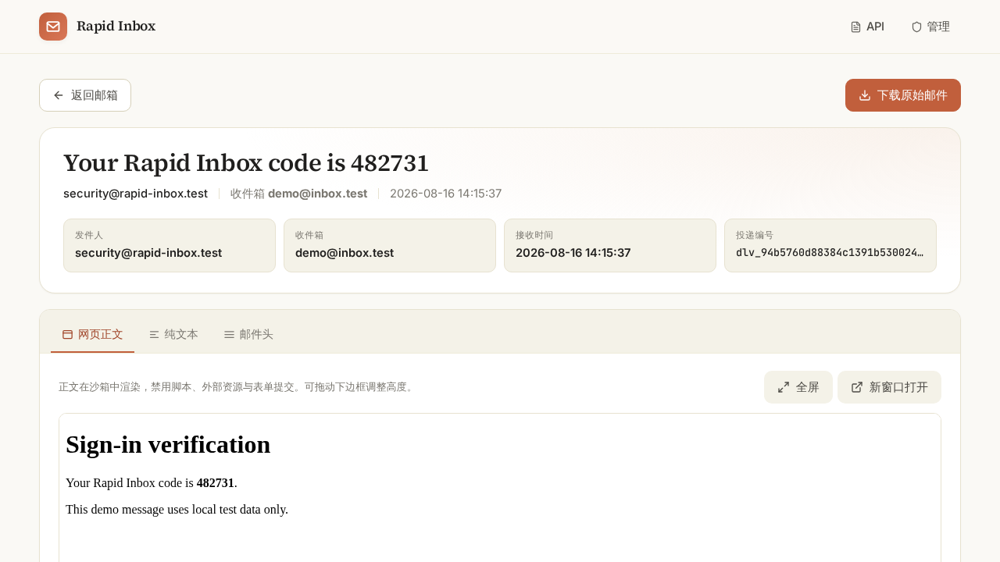

<div align="center">

**English** | [简体中文](README.zh-CN.md)

# Rapid Inbox

**A local-first, self-hosted temporary inbox for inbound email**

C++ SMTP ingress, optional public inboxes, an admin console, and an HTTP API<br/>
Mail, attachments, metadata, and audit records are stored on local disk and in SQLite

[](https://www.python.org)
[](https://isocpp.org)
[](https://fastapi.tiangolo.com)
[](https://www.sqlite.org)
[](LICENSE)
[](CHANGELOG.md)
[](https://github.com/wendaochangsheng/Rapid-Inbox/actions/workflows/release-ingestd.yml)
[](https://github.com/wendaochangsheng/Rapid-Inbox/releases)

[Quick Start](#quick-start) · [Demo](#demo) · [Project Scope](#project-scope) · [Roadmap](https://github.com/wendaochangsheng/Rapid-Inbox/issues/5) · [Implemented Features](#implemented-features) · [Configuration](#configuration) · [Usage](#basic-usage) · [Contributing](CONTRIBUTING.md) · [Security](SECURITY.md)

</div>

---

## Introduction

Rapid Inbox is built for open-source maintainers, developers, and test teams that need a
self-hosted email testing environment for **receiving verification codes**, **CI/E2E email
capture**, **internal-tool integration**, and **lightweight self-hosting**.

Its core goals are reliable ingestion, clear inspection, controlled access, and straightforward
recovery. Message bodies, attachments, and indexes are stored on local disk and in SQLite by
default, without depending on a third-party email SaaS or cloud database. Receiving mail from
the public Internet still requires your own domain, DNS/MX records, and a reachable SMTP ingress.

> The project is currently at an early Alpha stage. Interfaces and data structures may continue
> to change.

> **In short:** Rapid Inbox is an alpha-stage, inbound-only, self-hosted SMTP inbox for
> email testing, verification-code workflows, and internal integrations. It uses a
> single-host SQLite/local-filesystem architecture and is not an outbound mail server,
> hosted mailbox service, or multi-node mail platform.

## Project Scope

| Dimension | Current boundary |
| --- | --- |
| **Intended use** | Self-hosted inbound test mail, verification-code extraction, CI/E2E email capture, and internal-tool integration |
| **Deployment model** | Single-host local disk and SQLite. Docker Compose is the primary deployment path; the native systemd installer is secondary. Both run exactly one C++ ingestd and one Python HTTP process for one data directory |
| **HTTP paths** | The UI and API currently support deployment only at the site root `/`; reverse-proxy subpaths and ASGI `root_path` are not supported |
| **Explicit non-goals** | Outbound SMTP, IMAP/POP3, a full public MTA, hosted mailbox SaaS, advanced anti-spam or malicious-attachment sandboxing, and enterprise multi-node HA |
| **Operator responsibilities** | The project does not host or automatically configure DNS/MX, SMTP TLS termination, firewalls, backups, or global rate limiting across instances |
| **Public-access boundary** | Public Web/API access is disabled by default for new domains and the catch-all policy; anonymous Web browsing requires an explicit opt-in, and the public API still requires an API Key with `public.read` |
| **Data retention** | "Temporary mailbox" describes the use case, not default automatic destruction; mail is not deleted automatically when `retention_days` is unset or `0` |
| **Authorized use** | Operators must process only domains and mail they control or are explicitly authorized to handle; the project must not be used to intercept third-party mail, phish, collect credentials, send spam, or evade third-party rules |
| **Maturity** | `0.x` Alpha; there is no SLA or published throughput guarantee, and the database, configuration, and API may still receive incompatible changes |

See [Roadmap Issue #5](https://github.com/wendaochangsheng/Rapid-Inbox/issues/5) for the current plan and capabilities that are explicitly out of scope for now.

## Demo


<details>
<summary>View the static screenshot</summary>



</details>

> The demo uses sanitized test data in an isolated environment and contains no real mailboxes,
> messages, or credentials. It was recorded with Python's embedded SMTP server to demonstrate
> in-process WebSocket updates. In the default C++ ingestd mode, public inboxes do not receive
> real-time WebSocket pushes from the separate data-plane process; admin SSE connections and
> reconnections can only load recently committed history.

## Implemented Features

| Category | Capability |
| --- | --- |
| **Email ingestion** | C++ `rapid-inbox-ingestd` provides durable ACKs, byte-level backpressure, group commit, multi-worker MIME parsing, and poison-task isolation; Python SMTP remains available as a development mode |
| **Domain modes** | Receive only configured domains, or enable `managed_plus_catchall` for any-domain SMTP deliveries that reach this service; longest-suffix rules take precedence and domain rules are hot-reloaded |
| **Inboxes** | Domains are private by default; the per-mailbox public flag defaults to enabled but takes effect only when the domain-level public switch is enabled, and it can still be disabled per mailbox; supports lists, details, raw EML, sandboxed HTML previews, and attachment downloads |
| **Live updates** | Only the same-process HTTP + embedded Python SMTP mode pushes live updates through `LiveState`; when C++ ingestd or standalone Python SMTP runs in a separate process from HTTP, public inboxes require refreshes and admin SSE can load recent committed history on connect/reconnect but receives no continuous cross-process pushes |
| **Verification-code detection** | A scored extraction algorithm with Chinese, English, Japanese, Korean, and Spanish context plus alphanumeric and separated-code patterns |
| **Access control** | `viewer` / `operator` / `superadmin` RBAC; API Keys are constrained by kind, scope, domain grant mode, mailbox glob, IP, rate limit, and expiry |
| **HTTP API** | `/api/v2` is recommended: Bearer-only, strict models, Problem Details, and stable cursors; public and admin `/api/v1` endpoints remain available |
| **Observability** | JSON/text structured logs, safe Request IDs, Prometheus metrics, live/ready probes, and a cached operations dashboard |
| **Persistence and recovery** | SQLite WAL stores indexes; raw / text / html / attachments / manifests live on disk; manifests can rebuild metadata that was not committed |
| **Cleanup** | Delivery-retention cleanup in batches; file GC is registered inside the transaction and performed outside it with exponential-backoff retries; sessions, empty mailboxes, metrics, and audit records are cleaned independently |
| **Maintenance tools** | A cross-process `.maintenance.lock` coordinates clearing mail, pauses new ingestion, removes files, and compacts SQLite |

## Technology Stack

`Docker Compose` · `C++20` · `Python 3.10+` · `FastAPI` · `aiosmtpd` · `Jinja2` · `SQLite` · `Uvicorn` · `WebSocket` · `SSE`

## Quick Start

### Docker Compose (primary)

Docker Compose is the recommended deployment method. From a reviewed checkout, with Docker Engine
and Compose v2 installed, run:

```bash
./docker-deploy.sh
```

This one command builds the image, creates a mode-`0600` private configuration with random bootstrap,
cursor-signing, and metrics secrets, starts the Python control plane, waits for schema migration and
`/health/ready`, then starts the C++ SMTP ingress. The image runs as a non-root user. Both processes
are supervised in one container and one PID namespace because the cross-process maintenance protocol
records and verifies operating-system PIDs.

Default host bindings:

```text
HTTP: 127.0.0.1:8000
SMTP: 0.0.0.0:25
```

The first successful deployment prints the initial administrator password once. Open:

```text
http://127.0.0.1:8000/admin/login
```

> After the first bootstrap administrator login, the admin console **forces** a change of the
> initial password. The generated value remains in `.rapid-inbox-docker/rapid-inbox.env`; protect
> this file as a secret and replace the password in the administration UI immediately.

Mail, SQLite, manifests, and attachments are persisted in the Compose named volume
`rapid-inbox_rapid-inbox-data` by default. The deployment script never removes this volume.
Use the wrapper for lifecycle operations:

```bash
./docker-deploy.sh status
./docker-deploy.sh logs
./docker-deploy.sh credentials
./docker-deploy.sh update   # rebuild the current checkout with fresh base images
./docker-deploy.sh down     # retain configuration and the named data volume
```

Edit `.rapid-inbox-docker/rapid-inbox.env` to change published addresses, ports, or application
settings, then run `./docker-deploy.sh` again. For reproducible updates, check out a reviewed tag or
commit first; `update` does not fetch source code.

> [!CAUTION]
> Do not run `docker compose down -v` unless permanent deletion of the named volume is intended.
> Stop the deployment before making a consistent backup, and back up both the named volume and the
> private configuration. Do not place the SQLite volume on NFS or another filesystem without reliable
> local POSIX locking, and do not scale the Compose service beyond one replica.

> [!WARNING]
> Before the first Internet-facing deployment, confirm that the bootstrap password has been
> changed and keep the generated Metrics Token private. Compatibility
> `ADMIN_TOKEN` / `PUBLIC_API_KEY` credentials are disabled by default; new integrations should use
> API Keys issued from the admin console. HTTP is published only on host loopback by default. Put the
> admin plane behind a trusted HTTPS reverse proxy before changing that binding. The deployment does
> not configure DNS/MX, TLS termination, firewall rules, backups, or upstream anti-abuse controls.

See the [Docker deployment guide](deploy/docker/README.md) for backup, restore, rollback, port, and
troubleshooting procedures.

### Native systemd (secondary)

For Debian 12+ or Ubuntu 24.04+ hosts that require native services instead of Docker:

```bash
sudo bash deploy/system/install.sh install
```

The installer creates a dedicated `rapid-inbox` account, installs dependencies, stages a versioned
release under `/opt/rapid-inbox`, generates `/etc/rapid-inbox/rapid-inbox.env`, keeps data under
`/var/lib/rapid-inbox`, initializes and backs up SQLite at the write boundary, installs hardened
HTTP/SMTP units, and verifies HTTP plus SMTP protocol readiness.

```bash
sudo bash deploy/system/install.sh status
sudo bash deploy/system/install.sh update
sudo bash deploy/system/install.sh uninstall  # preserves configuration and data
```

See the [native systemd deployment guide](deploy/system/README.md) for the exact support boundary,
managed paths, update rollback, and uninstall behavior.

### Local source launcher

`quickstart.sh` is retained for local evaluation and development. It is a foreground launcher, not
a long-running production process manager:

```bash
bash quickstart.sh
```

It creates `.venv` and `.env`, initializes SQLite, and runs Python HTTP with C++ ingestd. By default,
it downloads the mutable `latest` ingestd release after SHA-256 verification; pin a reviewed release
with `--ingestd-version`, or build the current checkout with `--build-local`. Run
`bash quickstart.sh --help` for all options, including the Python SMTP compatibility mode.

## Local Development and Manual Startup

<details>
<summary><b>C++ SMTP ingestd + Python HTTP</b> (manual development topology)</summary>

```bash
# 1. Build the C++ SMTP ingress
cmake -S cpp/ingestd -B cpp/ingestd/build
cmake --build cpp/ingestd/build

# 2. Start Python HTTP without embedded SMTP
.venv/bin/uvicorn app.main:app --host 127.0.0.1 --port 8000

# 3. Start the C++ SMTP ingress
SMTP_HOST=0.0.0.0 SMTP_PORT=25 cpp/ingestd/build/rapid-inbox-ingestd --base-dir .
```

`INGEST_DURABLE_ACK=true` by default. Before SMTP returns `250 queued`, ingestd atomically writes
the raw EML and pending manifest. SQLite metadata can be committed later in a batch; if the process
exits in the meantime, the Python recovery worker rebuilds records from the manifest. Final parsed
manifests and the recovery worker share a 16 MiB per-file budget. If parsed metadata would exceed
that budget, ingestd retains a bounded pending manifest so recovery can parse the raw message again.
`INGEST_STORAGE_FSYNC=false` guarantees only process-crash recovery. Set it to `true` to cover host
power loss, at the cost of higher disk-sync latency. Disabling durable ACK returns to acknowledging
as soon as mail enters the in-memory queue; an abnormal process exit can then lose mail that already
received a `250` response.

Each SQLite batch commit rematches all recipients inside the transaction. A concurrent rename/delete
or fallback delivery to another tenant rolls back with `policy conflict`. If durable ACK was already
returned, the raw file and manifest are retained in an explicit quarantine forensic path, and the
recovery worker uses a persistent tombstone to prevent stale manifests from resurrecting renamed or
deleted domains.

</details>

<details>
<summary><b>HTTP + embedded Python SMTP in one process</b> (development/compatibility mode)</summary>

```bash
.venv/bin/rapid-inbox-http
```

</details>

<details>
<summary><b>Standalone Python SMTP listener</b> (compatibility mode)</summary>

```bash
.venv/bin/rapid-inbox-smtp
```

</details>

<details>
<summary><b>Development mode (module entry point)</b></summary>

```bash
.venv/bin/uvicorn app.main:app --reload
```

Running `uvicorn app.main:app` directly **does not** enable embedded SMTP. To receive SMTP mail,
run `rapid-inbox-ingestd` in another process. For development, use `rapid-inbox-http` or
`rapid-inbox-smtp`.

</details>

## CI and Release Binaries

The repository includes the GitHub Actions workflow `.github/workflows/release-ingestd.yml`:

- Regular pushes and pull requests run Python tests, validate both deployment paths, execute a real
  one-command Docker smoke deployment, and build/test C++ ingestd.
- Pushing a `v*` tag builds a Linux x86_64 release archive and publishes these files to a GitHub Release:
  - `rapid-inbox-ingestd-linux-x86_64.tar.gz`
  - `rapid-inbox-ingestd-linux-x86_64.tar.gz.sha256`

Example release commands:

```bash
git tag "$NEW_RELEASE_TAG"
git push origin "$NEW_RELEASE_TAG"
```

The publisher should set `NEW_RELEASE_TAG` explicitly according to the actual versioning policy.
Published versions are listed under
[GitHub Releases](https://github.com/wendaochangsheng/Rapid-Inbox/releases).

The Docker path builds a local image from the reviewed checkout; this workflow does not currently
publish a container image. After a Release is published, local-development `bash quickstart.sh`
downloads prebuilt ingestd from the mutable latest
release by default and prints a drift warning. Reproducible deployments should explicitly pass a
reviewed tag; use `--build-local` when a local build is required.

## Configuration

The application resolves variables in this order:

```text
Process environment  >  .env in the current working directory  >  defaults in app/config.py
```

Docker passes `.rapid-inbox-docker/rapid-inbox.env` as process environment; systemd uses
`/etc/rapid-inbox/rapid-inbox.env`. The repository `.env.example` is the local-source template.

<details>
<summary><b>Complete environment variable table</b></summary>

Python HTTP, compatibility SMTP, and shared configuration:

| Variable | `.env.example` | Description |
| --- | --- | --- |
| `STORAGE_ROOT` | `./storage` | Root directory for message files, attachments, manifests, and temporary files |
| `DATABASE_PATH` | `./storage/app.db` | SQLite database path; Python and ingestd must point to the same file |
| `BOOTSTRAP_ADMIN_USERNAME` | `admin` | Administrator username created automatically on the first start |
| `BOOTSTRAP_ADMIN_PASSWORD` | `change-me-now` (randomized by deployment scripts and quickstart) | The code fallback for manual startup is also `change-me-now` and must not be used with an Internet-facing bind |
| `SESSION_COOKIE_NAME` | `rapid_inbox_session` | Name of the HttpOnly administrator session cookie |
| `HOST` / `PORT` | `127.0.0.1` / `8000` | HTTP listen address and port; a non-loopback bind must be placed behind a trusted HTTPS reverse proxy |
| `HTTP_MAX_REQUEST_BODY_BYTES` | `1048576` | ASGI request-body limit for both `Content-Length` and streamed/chunked bodies; configurable up to 64 MiB |
| `HTTP_REQUEST_BODY_TIMEOUT_SECONDS` | `15` | Total time allowed to receive one complete HTTP request body, mitigating slow chunked uploads |
| `HTTP_BODY_MEMORY_BUDGET_BYTES` | `268435456` | Shared per-process byte budget for all buffered HTTP request bodies; must be at least the per-request limit |
| `HTTP_CONCURRENCY_LIMIT` | `1000` | Per-process admission limit across HTTP and WebSocket traffic; supported launchers also pass it to Uvicorn as `--limit-concurrency`, and application middleware enforces it |
| `HTTP_LIVE_CONNECTION_LIMIT` | `256` | Shared per-HTTP-process limit for admin SSE and public-mailbox WebSocket long-lived connections; excess connections receive 503/1013 |
| `DATABASE_WRITE_QUEUE_CAPACITY` / `DATABASE_WRITE_MAX_WAITERS` | `256` / `1024` | Dual limits for requests accepted by the single SQLite write actor and requests waiting for it; excess load fails fast with 503 |
| `DATABASE_READ_POOL_SIZE` / `DATABASE_READ_QUEUE_CAPACITY` / `DATABASE_READ_MAX_WAITERS` / `DATABASE_READ_TIMEOUT_SECONDS` | `1` / `256` / `1024` / `5` | API v2 dedicated read-only actors, admitted-request and waiting-request limits, and end-to-end read timeout. A single actor is the conservative default; benchmark the actual workload before increasing connections. Maintenance first drains requests, then the owner thread closes connections. All values are calculated independently per HTTP process |
| `SMTP_HOST` / `SMTP_PORT` | `0.0.0.0` / `25` | SMTP listen address and port |
| `MAX_MESSAGE_SIZE_BYTES` | `52428800` | Maximum size of one message, shared by Python and C++ |
| `MAX_RECIPIENTS_PER_MESSAGE` | `20` | Maximum number of canonical recipients per message |
| `SMTP_IDLE_TIMEOUT_SECONDS` | `30` | Idle timeout for an SMTP session |
| `SMTP_MAX_CONCURRENT_CONNECTIONS` | `1024` | Python SMTP concurrent-connection limit; `0` is not allowed for non-loopback listeners |
| `SMTP_CONNECTION_RATE_LIMIT_COUNT` | `60000` | Python/C++ SMTP connections allowed per IP. Python uses bounded expiry/LRU state; C++ uses a fixed-capacity map, periodically removes expired entries, and evicts one entry when full. Both are per-process and provide no global rate limit across instances |
| `SMTP_CONNECTION_RATE_LIMIT_WINDOW_SECONDS` | `60` | Sliding window for Python/C++ SMTP per-IP connection limits |
| `SMTP_CLOSE_AFTER_DATA` | `true` | Whether Python SMTP closes the connection after completing one DATA command |
| `PARSE_WORKER_COUNT` | `4` | Number of Python recovery/compatibility parsing workers |
| `PARSE_QUEUE_MAX_MESSAGES` | `10000` | Budget for queued + active messages in the Python MIME queue |
| `PARSE_QUEUE_MAX_BYTES` | `536870912` | Raw-message byte budget for queued + active work in the Python MIME queue; must be at least `MAX_MESSAGE_SIZE_BYTES` |
| `MESSAGE_PREVIEW_BODY_BYTES` | `131072` | Maximum UTF-8 source bytes read independently for text and HTML in public/admin details; responses include original sizes and truncation flags; configurable up to 16 MiB |
| `MESSAGE_PREVIEW_HEADERS_BYTES` | `65536` | Maximum mail-header JSON size that details may deserialize; over-budget headers return an empty list with a truncation flag; configurable up to 1 MiB |
| `MESSAGE_PREVIEW_INLINE_ITEM_BYTES` | `65536` | Source-byte budget for one inline image in an HTML CID preview; an over-budget item retains its original CID and remains available as an attachment download |
| `MESSAGE_PREVIEW_INLINE_TOTAL_BYTES` | `262144` | Aggregate source-byte budget for all inline images in one HTML preview; the per-item budget must not exceed this total |
| `FSYNC_STORAGE_WRITES` | `false` | Whether Python performs fsync for file and directory writes |
| `INGRESS_MODE` | `managed_only` | `managed_only` or `managed_plus_catchall` |
| `CATCH_ALL_PUBLIC_WEB_ENABLED` | `false` | Whether catch-all policy permits public Web access |
| `CATCH_ALL_PUBLIC_API_ENABLED` | `false` | Whether catch-all policy permits public API access |
| `CATCH_ALL_RETENTION_DAYS` | `0` | Retention period for catch-all deliveries; `0` means no automatic expiry |
| `RETENTION_CLEANUP_INTERVAL_SECONDS` | `30` | Background cleanup scheduling interval |
| `SMTP_SESSION_RETENTION_SECONDS` | `86400` | Retention period for completed SMTP sessions |
| `EMPTY_MAILBOX_RETENTION_SECONDS` | `86400` | Retention period for empty mailboxes with no deliveries |
| `METRIC_RETENTION_SECONDS` | `604800` | Retention period for mail metric buckets |
| `AUDIT_RETENTION_DAYS` | `90` | Audit-log retention period |
| `CLEANUP_BATCH_SIZE` / `FILE_GC_BATCH_SIZE` | `1000` / `500` | Per-run limits for database cleanup and file GC |
| `MAINTENANCE_RUN_RETENTION_DAYS` | `30` | Retention period for completed/failed maintenance-run records |
| `QUARANTINE_RETENTION_DAYS` | `30` | Retention period for quarantine forensic files |
| `ORPHAN_ARTIFACT_GRACE_SECONDS` | `86400` | Minimum file age before scanning unreferenced raw/text/HTML/attachment artifacts, reducing races with in-flight work |
| `ARTIFACT_SWEEP_BATCH_SIZE` | `500` | Maximum quarantine and orphan files each scan inspects per cleanup run; a pass resumes across cleanup runs |
| `DISK_WARNING_THRESHOLD_PERCENT` | `85` | Dashboard disk-usage warning threshold |
| `LOG_LEVEL` / `LOG_FORMAT` | `INFO` / `json` | Log level and `json` / `text` format |
| `REQUEST_LOG_ENABLED` | `true` | Whether to record structured HTTP access logs without query strings |
| `METRICS_ENABLED` / `METRICS_TOKEN` | `true` / empty | Prometheus endpoint toggle and token; when metrics are enabled on a non-loopback bind, a token is required or startup is refused |
| `API_CURSOR_SECRET` | empty (randomized by deployment scripts and quickstart) | HMAC secret for API v2 cursors; manual Internet-facing deployments must configure at least 32 characters |
| `READINESS_MIN_FREE_DISK_BYTES` | `67108864` | Minimum free disk space required for readiness |
| `ADMIN_TOKEN` / `PUBLIC_API_KEY` | disabled | v1 compatibility tokens; enabled only when explicitly configured with non-default random values |

Preview budgets are per-request limits. CID images grow by roughly 4/3 when converted to data URLs;
if body and inline budgets are increased together, worst-case concurrent memory grows roughly in
proportion to `HTTP_CONCURRENCY_LIMIT`. Production deployments should set these values together
according to available memory. Full content remains available through streamed raw-message and
attachment downloads.

Hot-path configuration dedicated to C++ `rapid-inbox-ingestd`:

| Variable | Default | Description |
| --- | --- | --- |
| `SMTP_MAX_CONNECTIONS` | `1024` | Maximum simultaneous C++ SMTP connections |
| `SMTP_MAX_LINE_LENGTH` | `1000` | Maximum SMTP command/data line length |
| `SMTP_LISTEN_BACKLOG` | `1024` | C++ SMTP kernel listen backlog; `SMTP_HOST=::` can listen on IPv6 |
| `SMTP_CONNECTION_RATE_LIMIT_COUNT` / `SMTP_CONNECTION_RATE_LIMIT_WINDOW_SECONDS` | `60000` / `60` | Per-IP connection sliding window shared by C++ and Python; lower it according to edge abuse risk |
| `INGEST_QUEUE_MAX_MESSAGES` | `10000` | Total budget for reserved, queued, and active messages |
| `INGEST_QUEUE_MAX_BYTES` | `536870912` | Byte budget; must be at least `MAX_MESSAGE_SIZE_BYTES` |
| `INGEST_RESERVATION_CHUNK_BYTES` | `65536` | Byte reservation growth chunk during DATA, avoiding reservation of the full message limit per connection |
| `INGEST_BATCH_MAX_MESSAGES` | `250` | Maximum messages in one group commit |
| `INGEST_FLUSH_INTERVAL_MS` | `5` | Maximum time to wait for messages to join the same batch |
| `INGEST_SQLITE_BUSY_TIMEOUT_MS` | `5000` | SQLite lock wait time |
| `INGEST_WORKER_COUNT` | `4` | Number of parallel MIME/file-processing workers |
| `INGEST_MAX_RETRIES` | `3` | Bounded retries after one message fails, followed by quarantine |
| `DOMAIN_RELOAD_INTERVAL_MS` | `1000` | Interval for hot-reloading domain rules from SQLite |
| `INGEST_DURABLE_ACK` | `true` | Write raw + pending manifest before SMTP `250` |
| `INGEST_STORAGE_FSYNC` | `false` | fsync files and directories before ACK; protects against power loss when enabled but reduces throughput |

</details>

## Basic Usage

1. Start the service and sign in at `/admin/login`.
2. Select an ingestion mode: add one or more managed domains, or enable catch-all mode in system settings.
3. Explicitly enable Web or API access for domains/catch-all policy that truly need public inspection; keep the defaults private.
4. Deliver a test message to any matching mailbox, for example `code@example.com`.
5. Inspect private mail in the admin console, or use an authorized public page/API.
6. Issue automation clients an API Key with the minimum scope and minimum domain grant.

### Ingestion Modes and Public Access Boundaries

- `managed_only`: accept only domains enabled in the database and matched by exact/subdomain rules.
- `managed_plus_catchall`: managed domains still use longest-suffix-first matching; other valid domains fall through to the system's `*` policy. Domains do not need to be pre-registered individually for deliveries that have already reached this SMTP service.
- Catch-all mode does not change public DNS routing and cannot receive third-party mail whose MX does not point to this service. Receiving mail from the public Internet still requires an A/MX record for a domain you control and reachable TCP port 25; for testing, an upstream relay may deliver directly to this host.
- Public Web/API switches are disabled by default for new managed domains and the `*` policy. A new mailbox's `public_enabled` flag defaults to enabled, but is a second-level gate under the domain switch; after a domain is explicitly made public, each mailbox can still be disabled. SMTP acceptance does not imply anonymous read access; authorized administrators or service Keys can always read private mail.
- When one message is delivered to multiple recipients, recipients are de-duplicated by canonical mailbox. Shared message/raw/attachment files enter final cleanup only after every delivery expires.
- Creating a more specific managed suffix or changing plus/case canonicalization creates a persistent `domain_rehome_jobs` record for existing catch-all/parent-domain mailboxes in the same write transaction. The worker processes at most 1,000 mailboxes per batch and commits independently, allowing SMTP writers to take priority between batches. Jobs resume from a cursor after cancellation, process exit, or a transient failure. Migration only moves mail one way into a more-specific managed rule, merges duplicate deliveries, and recalculates summaries; a managed mailbox never falls back to `*` because a rule was disabled.

### Public Pages

```text
GET  /
GET  /mail/{mailbox_address}
GET  /mail/{mailbox_address}/{delivery_id}
GET  /mail/{mailbox_address}/{delivery_id}/raw
GET  /mail/{mailbox_address}/{delivery_id}/attachments/{attachment_id}
```

### Public API Examples

```bash
curl \
  -H "X-API-Key: <your-public-api-key>" \
  "http://127.0.0.1:8000/api/v1/public/mailboxes/code@example.com/messages"
```

The endpoint supports `limit`, the legacy-compatible `offset`, and returns `next_cursor`. New
integrations should use `next_cursor` for pagination:

```bash
curl \
  -H "X-API-Key: <your-public-api-key>" \
  "http://127.0.0.1:8000/api/v1/public/mailboxes/code@example.com/messages?limit=20&cursor=<next_cursor>"
```

New integrations can also use the v2 public-mailbox resource directly. A `public` Key uses Bearer
authentication and remains constrained by domain grant mode, mailbox glob, and domain/mailbox public
API switches:

```bash
curl \
  -H "Authorization: Bearer <ri_public_...>" \
  "http://127.0.0.1:8000/api/v2/public/mailboxes/code@example.com/messages?limit=20"
```

### API v2 (Recommended for New Integrations)

`/api/v2` accepts `admin`, `service`, and `public` Keys, but only standard Bearer headers. Credentials
in query parameters or `X-API-Key` are rejected. A `public` Key may call only `/me` and public mailbox
resources allowed by `public.read`; `service` and `admin` Keys are further narrowed by kind, scope,
domain, and mailbox authorization. JSON responses use strict envelopes, file downloads use their
corresponding media types, and errors use `application/problem+json`. List cursors are bound to the
resource and filters and signed with `API_CURSOR_SECRET`; rotating that secret immediately invalidates
old cursors. OpenAPI is available at `/docs` and `/openapi.json`.

```bash
curl \
  -H "Authorization: Bearer <ri_service_...>" \
  "http://127.0.0.1:8000/api/v2/messages?limit=50"
```

The current v2 surface covers principal, public mailbox list/verification-code/detail/raw/attachment resources,
domain and DNS checks, mailbox operations, message detail/raw/attachment/reparse/delete, SMTP sessions
and events, audit, dashboard, manual cleanup/clear, system settings, and the full API-Key and admin
lifecycle. Admin live streams and cross-message bulk deletion remain under `/api/v1/*`. New code should
prefer resources covered by v2 and follow the operations actually present in OpenAPI.

Every v2 cursor has a 2,048-byte input limit, an HMAC signature, and resource/filter binding. Retained
v1 public-mailbox cursors are also bound to the calling credential and mailbox. v1 domain lists and SMTP
events use hard pagination, and bulk deletion accepts at most 1,000 delivery IDs per request. v2 API-Key
listing scans at most 5,000 candidates per request; when a low-privilege principal filters out many old
Keys, it returns a continuation cursor instead of scanning without bound to fill a page.

### Permission Model

Admin sessions have three roles:

- `viewer`: read runtime status, domains, mailboxes, messages, SMTP, audit, settings, Key metadata, and administrator metadata.
- `operator`: all viewer permissions plus write access for domain, mailbox, and message handling.
- `superadmin`: high-risk system settings, API Keys, administrators, password resets, and session revocation; the system prevents deleting or demoting the last enabled superadmin.

API Keys first constrain selectable scopes by kind: `public` may use only `public.read`, `service` is
for business resources, and only `admin` may hold Key/administrator/system-write scopes. Domain grants
must be explicit:

- `none`: grants no domains;
- `selected`: grants only listed domain IDs; an empty list still denies access;
- `all`: grants all current and future domains.

Mailbox globs, allowed IP CIDRs, Header/Query transport modes, per-minute limits, expiry, and revocation
further narrow permissions. An empty domain list on a new Key no longer implicitly means all domains.
Key creation, update, rotation, revocation, and deletion re-read caller and target permissions in the
same SQLite writer transaction, preventing authorization races caused by policy changes while a request
waits in the queue.

Administrator delegation is re-authorized in the write transaction as well: creating a login-capable
account requires both `admins.write` and `admins.credentials.write`; password reset and session
revocation require `admins.credentials.write` and `admins.sessions.write` respectively, and the target
role's effective scope may not exceed the caller's own scope.

Domain, mailbox, and message endpoints filter resources by `selected` grants. Global resources such as
dashboard/live status, SMTP sessions, audit, system settings, maintenance, and administrators cannot
be safely partitioned by domain, so their v1/v2 endpoints require `domain_grant_mode=all`; v2 API-Key
lifecycle operations also require all-domain authorization. A restricted v1 Key manager can operate only
on Keys within the caller's scope and domain grants.

A `selected`-domain principal may update ordinary policy for an authorized domain, but changing the
domain identifier `root_domain` changes the authorization boundary and is therefore limited to a
principal with `domain_grant_mode=all`. The service layer confirms this condition again in the same
write transaction.

## Logs, Health Checks, and Metrics

- `/health/live` is the process liveness probe; `/health/ready` checks runtime state, background tasks, SQLite, the storage directory, and minimum free disk; `/version` reports the application version, recommended API `v2`, and the list of supported `v1`/`v2` APIs.
- `/metrics` exposes Prometheus text metrics including route-aggregated request counts/latency, in-flight requests, background tasks, readiness, process CPU/memory, and uptime. With `METRICS_TOKEN`, use Bearer or `X-Metrics-Token`; when `METRICS_ENABLED` is disabled, the endpoint returns 404. A non-loopback bind with metrics enabled and no token refuses startup; loopback development is the only mode that permits tokenless access.
- HTTP responses carry a safe `X-Request-ID`. Access logs record route templates but not query strings, preventing compatibility Query Keys from leaking into logs. `LOG_FORMAT=json` suits collectors and `text` suits local troubleshooting. Formatting and output run on a separate thread with capacity 4,096, so a slow log sink does not block the event loop; queue-full, output-failure, and close-timeout drops are counted by `rapid_inbox_log_records_dropped_total` with fixed reasons.
- The `/admin` dashboard gathers database/disk state asynchronously through a short-TTL shared snapshot and displays RPS, P95, receipt/delivery/rejection/parse-failure counts, SMTP, parse queues, DB/WAL, disk, background jobs, and recent cleanup. Domain/mailbox/message/Key/audit totals are maintained by transaction triggers in one counter row; traffic uses minute buckets, so a 24-hour query reads at most about 1,441 buckets rather than scanning linearly with that day's message count.

## Performance Boundaries and Deployment Topology

Rapid Inbox is designed for a single-host local-disk architecture. It is not an unlimited horizontal
scaling promise or an unmeasured throughput guarantee:

- SQLite uses WAL for concurrent reads, but still has one write transaction at a time. Ingestd can parse and write files in parallel; SQLite group commits are serialized briefly by a mutex, and Python changes are serialized by the `DatabaseWriter` write lock.
- `/api/v2` uses Runtime-private persistent read-only actors with `mode=ro/query_only` connections. Admission, waiting, and deadlines are bounded, and maintenance drains and closes them first. A single actor is a conservative default; benchmark the actual workload before adding connections, because blindly adding threads can amplify Python row-materialization GIL/futex contention. Write connections explicitly use `synchronous=FULL`.
- The `/api/v2` SQLite hot path is offloaded to dedicated actors and raw/attachment responses remain streamed. The dashboard uses a roughly 1.5-second shared cache and a stampede-prevention lock. New high-concurrency integrations should prefer v2; retained v1 routes remain compatibility surface. These optimizations do not remove disk IOPS or the SQLite single-writer ceiling.
- API-Key authentication uses a bounded approximately two-second in-process cache. Cache hits do not switch to the default thread pool; misses perform an asynchronous database read. Key changes in this process actively invalidate the cache after commit; selected-domain authorization is not cached to preserve FK-level fail-closed behavior. `last_used_at` is written at most about every 30 seconds, so it is an operations signal rather than a per-request audit trail.
- API-Key rate limiting uses a fixed-memory token bucket per Key. Bucket capacity equals the per-minute quota and refills evenly over 60 seconds, allowing short bursts up to the bucket capacity. State remains per HTTP process; with N workers, total available quota is roughly N times the per-process quota. Enforce a strict global quota at a reverse proxy/gateway.
- Run exactly one ingestd and one HTTP process for a data directory. Do not scale the Compose `app`
  service, deploy multiple Swarm/Kubernetes replicas, or point independently managed containers at
  the same volume. Do not place SQLite WAL on a network filesystem without reliable POSIX locking,
  and do not let multiple hosts share one `app.db`.
- C++ and Python SMTP currently do not implement or advertise STARTTLS. For encrypted public transport, terminate TLS at a verified SMTP proxy or expose the receipt port only to a trusted network; place the HTTP admin plane behind an HTTPS reverse proxy as well.

Before tuning workers, batches, queues, fsync, or HTTP concurrency, use the repository stress scripts on
the actual disk to measure throughput, P95/P99, WAL growth, `451` ratios, recovery time, and power-loss
requirements, and reserve explicit limits for queues and disk.

## Data and Retention Policy

Rapid Inbox stores structured data in SQLite and splits message content across local directories:

```text
storage/
├── app.db           # SQLite indexes and metadata
├── raw/             # Raw EML
├── text/            # Parsed plain text
├── html/            # Parsed HTML
├── attachments/     # Attachments
├── manifests/       # Manifests used for startup recovery
├── quarantine/      # Tasks and manifests that could not be persisted/verified
└── tmp/             # Temporary files
```

Mail no longer uses a global hard-coded "10-minute" retention period. Managed domains set each
delivery's `expires_at` through `retention_days`; when unset, deliveries do not expire automatically.
Catch-all delivery uses `CATCH_ALL_RETENTION_DAYS`, whose default `0` likewise means no automatic
expiry. Domain-policy changes affect only newly created deliveries and do not rewrite historical
expiry times.

Cleanup removes expired deliveries in `CLEANUP_BATCH_SIZE` batches. Message metadata is removed only
after every delivery for that message has expired. The same database transaction registers raw,
body, manifest, and attachment paths in `file_gc_tasks`; actual files are deleted outside the
transaction, with the failure reason recorded and retries using exponential backoff. This avoids
silently leaving half-applied state between a database commit and filesystem failure. SMTP sessions,
empty mailboxes, metric buckets, and audit records have independent retention settings.

Each cleanup run also removes quarantine files older than `QUARANTINE_RETENTION_DAYS` and incrementally
scans, up to `ARTIFACT_SWEEP_BATCH_SIZE`, for raw/text/HTML/attachment artifacts with no database,
manifest, quarantine, file-GC, or in-flight ingestion reference. A scan pass resumes across runs from
its previous position. A file must be at least `ORPHAN_ARTIFACT_GRACE_SECONDS` old to qualify, reducing
races with files being persisted or recovered. Completed maintenance records are removed in batches
according to `MAINTENANCE_RUN_RETENTION_DAYS`.

The Python parsing queue limits both message count and raw bytes, and the budget covers queued and
active workers. Once raw data, manifests, and database state have been persisted, a temporarily full
queue still preserves SMTP success. A background pending scan re-enqueues older messages first so
already acknowledged mail is not discarded for memory backpressure.

An admin/API `DELETE` immediately marks the target delivery deleted and sets `expires_at` to the
current time. The next cleanup run hard-deletes it; if the message has no other deliveries, metadata
and files continue through the file-GC outbox. DELETE therefore takes immediate effect for read
visibility, while disk reclamation is an asynchronous, retryable operation. Call
`POST /api/v2/maintenance/cleanup` to accelerate processing.

Deleting all mail in a mailbox does not update all historical deliveries in one long transaction.
In the final authorization transaction, the service freezes the mailbox's current deletion generation
and maximum delivery rowid, advances the mailbox to the next generation, and creates a persistent
`mailbox_bulk_delete_jobs` record. The worker processes at most 1,000 rows per batch and can resume
after cancellation, failure, or restart. Deliveries that arrive or migrate after job creation inherit
the new generation, so an old job cannot delete them even if retention deletes the highest rowid and
SQLite reuses it. Job creation is the authorization linearization point: domain or mailbox grants
revoked before it are rejected atomically; an authorized, persisted job completes within its original
scope.

Only one C++ ingestd may use a given `STORAGE_ROOT`. On startup it holds a kernel file lock on
`.ingestd.instance.lock`; normal exit and crashes release the lock automatically. The lock file is
intentionally retained, and only the OS lock indicates ownership. The SQLite writer reuses one
connection and prepared statements across batches. SQLite errors, database-file replacement, or a
maintenance drained ACK invalidate the session so it can be rebuilt safely for the next batch.

Startup recovery checks manifest and raw-file size/SHA-256 and restores uncommitted domain policy,
messages, deliveries, and parsed results. Full history, permanent-failure retries, and same-timestamp
watermark paths are processed in batches through temporary on-disk SQLite, so core replay state does
not grow linearly with total history. Each manifest and each decode/replay batch is limited to 16 MiB.
A manifest with missing domain policy, corruption, or an over-budget payload fails closed into
quarantine; it neither infers public access nor blocks recovery of other mail. "Clear all messages"
in the admin console creates a cross-process `.maintenance.lock`, makes C++ ingestd temporarily return
`421/451`, stops parsing, clears mail tables, atomically moves raw/text/html/attachments/manifests/tmp,
and compacts SQLite. Domains, administrators, API Keys, audit/maintenance records, and quarantine are
retained for separate forensic disposal. An expired heartbeat is accepted only after its PID is
confirmed to have exited; a live or unverifiable process must produce a matching drained ACK or time
out.

Do not use `mv`, `os.replace`, or backup restoration to replace `app.db` while the service is running.
A reader in one process can detect an inode change, but a Python writer, C++ ingestd, other HTTP
processes, and `-wal`/`-shm` sidecars cannot atomically switch through a single connection pool. To
restore a database, stop every HTTP/SMTP process, handle the main file and sidecars according to the
SQLite backup procedure, run integrity checks, and then start the entire service again.

## Upgrades and Incompatible Changes

The current `0.x` series evolves toward the new security model and does not promise legacy call
semantics:

- New domains default to `public_web_enabled=false` and `public_api_enabled=false`; public access must be explicitly enabled.
- An empty API-Key domain list no longer means all domains. Existing Keys migrate to `selected` when grants exist, or fail-closed `none`; explicitly choose `all` when access to future domains is needed.
- API v2 uses `Authorization: Bearer`, strict fields, and cursors; it rejects Query Keys and does not guarantee compatibility with v1 response shapes. Internet-facing deployments must now provide a stable `API_CURSOR_SECRET`.
- Mail expiry is delivery-level `expires_at`; `retention_days=NULL/0` means no automatic expiry and no longer inherits the old global 10-minute rule.
- C++ ingestd enables durable ACK by default. If an earlier deployment depended on the very low latency of "in-memory enqueue means 250," it can be disabled explicitly, with the risk of losing mail on an abnormal exit.

Before every upgrade, retain a restorable copy of configuration, mail artifacts, and SQLite. For
Docker, stop the deployment, back up `.rapid-inbox-docker/rapid-inbox.env` and the named volume, check
out the reviewed target commit, then run `./docker-deploy.sh`; the wrapper starts SMTP only after HTTP
migration and readiness succeed. For systemd, `sudo bash deploy/system/install.sh update` stages and
builds first, then stops both writers, creates a consistent SQLite backup, migrates, switches the
release, and performs HTTP/SMTP acceptance. Manual deployments must stop all old HTTP/SMTP processes
and allow exactly one migrator before ingestd starts. Never let old and new binaries write the same
database concurrently. Afterward, recheck domain public switches, Key `domain_grant_mode`, retention,
Metrics Token, and fsync choices.

## Development

```bash
# Install
python3 -m venv .venv
.venv/bin/pip install -c constraints-dev.txt -e ".[dev]"

# Test C++ ingestd (build first so the cross-language integration test is not skipped)
cmake -S cpp/ingestd -B cpp/ingestd/build
cmake --build cpp/ingestd/build
ctest --test-dir cpp/ingestd/build --output-on-failure

# Python tests; when ingestd is built, these also run the cross-language integration tests
.venv/bin/pytest

# Selected test files
.venv/bin/pytest tests/test_admin_api.py tests/test_public_routes.py
```

### SMTP / HTTP Stress Testing

Use the included scripts to deliver verification-code messages in bulk and sample CPU and memory for
C++ ingestd / Python HTTP:

```bash
.venv/bin/python tools/smtp_stress_test.py \
  --to code@example.com \
  --count 5000 \
  --concurrency 100 \
  --json-output .rapid-inbox-run/smtp-stress.json
```

By default, the tool waits for and verifies SQLite persistence/parsing counts. Add `--no-db-check` to
measure only SMTP ACKs. The HTTP tool permits only GET/HEAD. Pass its Bearer token through an environment
variable to keep it out of shell history:

```bash
RAPID_INBOX_API_TOKEN='<ri_service_...>' \
  .venv/bin/python tools/http_stress_test.py \
  --url http://127.0.0.1:8000/api/v2/domains \
  --count 5000 \
  --concurrency 100 \
  --json-output .rapid-inbox-run/http-stress.json
```

Both report throughput, P50/P95/P99, and failures. See the actual script help for all parameters:

```bash
.venv/bin/python tools/smtp_stress_test.py --help
.venv/bin/python tools/http_stress_test.py --help
```

Runtime and development dependencies are pinned to exact versions in `pyproject.toml`, and
`constraints-dev.txt` records one verified development dependency resolution. After pulling new code into an existing
virtual environment, rerun the installation command so entry points and dependency versions match.

## Security Notes

- Never use the default administrator password in a public environment. Prefer disabling compatibility tokens; if they are required, configure separate high-entropy values.
- Catch-all mode accepts deliveries that have reached this SMTP service and whose RCPT domain syntax is valid, but it does not replace DNS/MX configuration. Read access is private by default; do not enable public Web/API globally for convenience.
- When `/metrics` is enabled on a non-loopback bind, `METRICS_TOKEN` is mandatory or startup is refused; the metrics endpoint can also be disabled.
- API-Key token buckets are local to one HTTP process. Multi-process deployments must also enforce global rate limits at a trusted reverse proxy.
- Docker maps host port `25` to non-privileged container port `2525`; the systemd unit grants only `CAP_NET_BIND_SERVICE` to its dedicated account. Manual deployments still need an equivalent privilege boundary.
- Public inboxes are intended for testing and temporary workflows, not sensitive long-term mail.
- Do not commit `.env`, `storage/`, databases, or persisted mail files to Git.

For security issues, read [SECURITY.md](SECURITY.md) first.

## Contributing

Issues, fixes, and improvements are welcome. The project is maintained by
[@wendaochangsheng](https://github.com/wendaochangsheng). Read
[CONTRIBUTING.md](CONTRIBUTING.md) before starting; it covers the development workflow, tests, and
pull-request guidance.

## License

Rapid Inbox is released under the [MIT License](LICENSE).

<div align="center">

<sub>Built with ❤ for local-first email workflows</sub>

</div>
